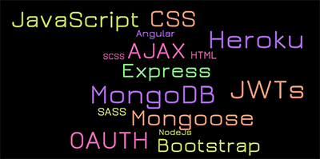
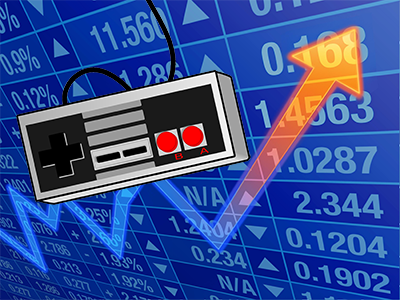
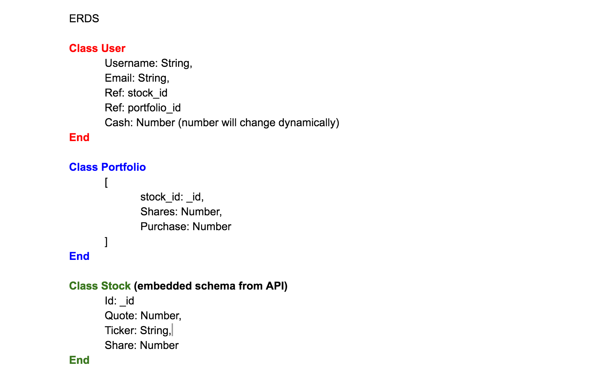

#Young Stock Money

## Full-stack MEAN App

## Young Stock Money

### Description

Young Stock Money is a stock simulator where you can play, level up, and gamble away digital money on Real Time Stocks! Whether you are training, playing around, or showing off your high score “gains”, Young Stock Money is an exciting game due to the wonderful combination of luck and skill. If it were solely a game of skill, the inexperienced wouldn't play because they would lose their digital cash every time. If it were too much about luck, the professional players would give up and never test their success from Young Stock Money against the wolves of Wall Street!

---
### Trello Link 

[Young Stock Money Trello](https://trello.com/b/P0fQ9iXh/project-4-full-stack-application)

---

---
### Heroku Link (Link to hosted app)

[Heroku](http://www.shroyco.com/sites/default/files/coming-soon_0.jpg)

Just kidding, coming soon!

---

### Technologies Used

Young Stock Money will use the following languages and technologies:

* MongoDB
* Express
* AJAX
* Mongoose
* Angular
* NodeJs
* OAUTH
* HTML
* CSS
* SCSS
* SASS
* JavaScript
* Bootstrap
* Heroku
* JWTs

---

###Come into the mind of Desi...
##Approach Taken:

Young Stock Money brings together both realism of finances and stocks and the level up high score action of an online video game. This is a game in which two opposite demographics are brought together to teach one another how to have a new type of fun.

The name of the game:

As a user you begin as signing up to Young Money Stock, and start off with 50,000 dollars.

*"WHOA, WHAT?!"*

LET US BUY AND SELL! Just kidding. We do not want our user to have this ability until they have earned it. This means that there will be certain levels into the game. Level one will give the user a time delay to make sure they want to buy/sell. When I am done with this functionality, I will place in a feature that will estimate the future outcome of the user’s shares based off a certain past history of that stock. After a certain amount of money is added into the user’s data (from both stock and cash value), level two will come into play where the feature will disappear and the game will now be played with a click of a button AT THE USER’S OWN RISK.

Why is this worth it? People who are familiar with stocks do not wish to waste their skill into a game. However, these users are getting points, losing points, and showing off their skills, but they are doing it with stocks. They are also gambling, but they are gambling without a risk. It is a stock trainer, gaming fun attractive way to impress anyone with your skills before (or during) going out with your precious IRL cash.

---

##ERDs

ERD will consist of three models

